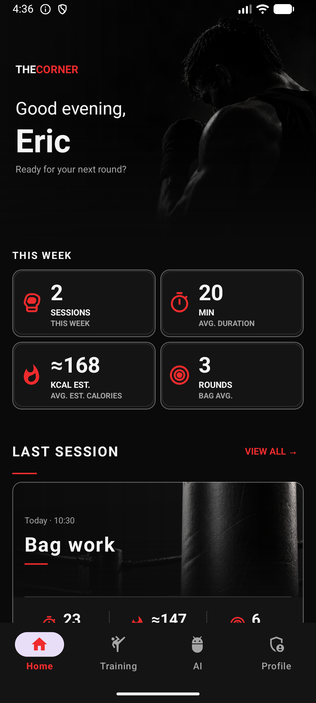
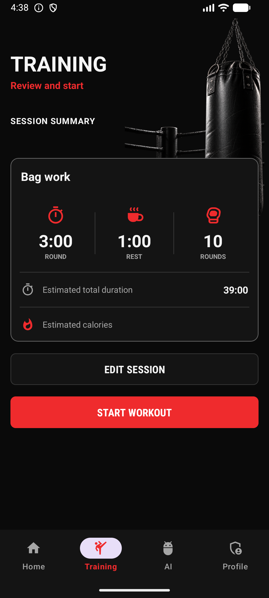
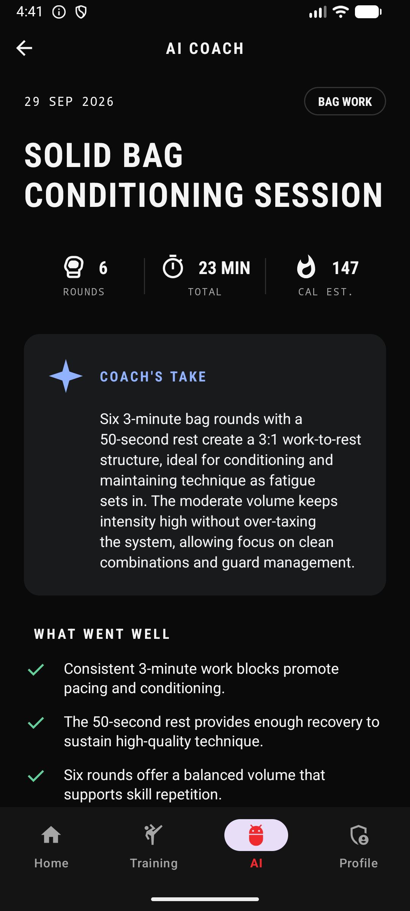
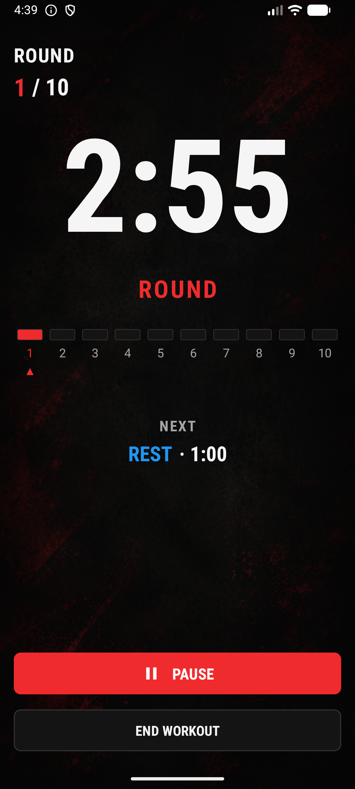
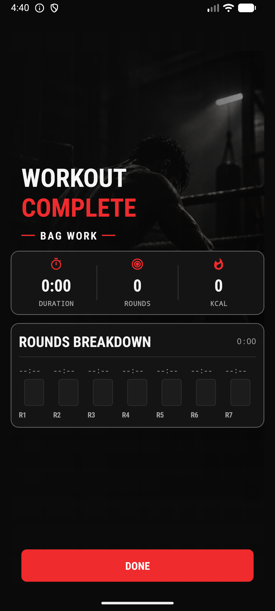
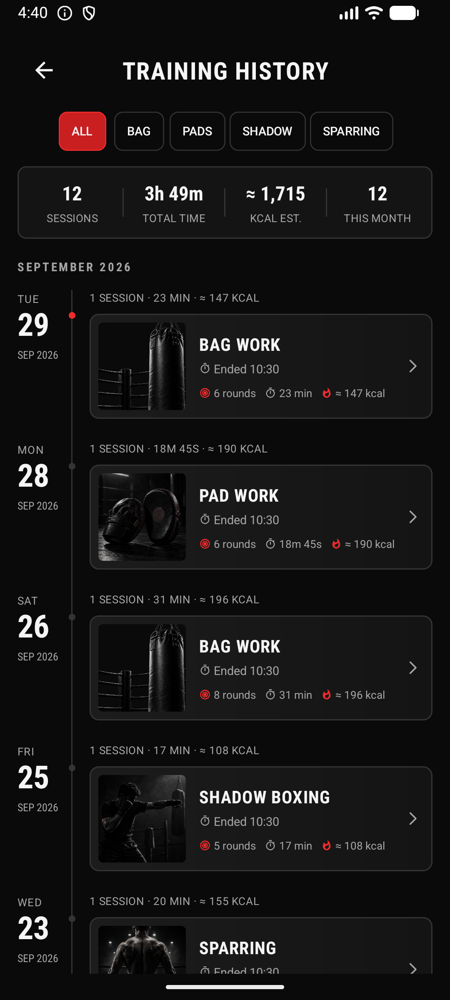
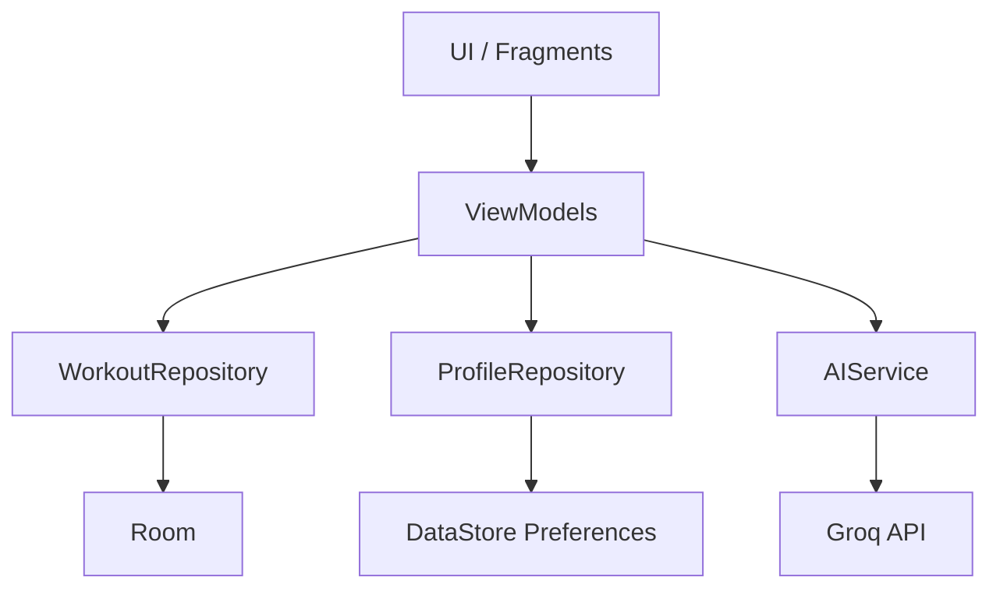

# The Corner

**A boxing training companion for Android.**

Configure training, work through timed rounds, track sessions, and review performance with AI-assisted feedback.

Built with Kotlin, Room, MVVM, and Groq.

## At a glance

<p align="center">
  
  
  
</p>

## Overview

The core experience is deliberately simple:

```text
Configure -> Train -> Complete -> Review -> Improve
```

Users choose a boxing workout type, set the number and length of rounds, train with a guided round/rest timer, save completed sessions locally, review their history, and use AI Coach to reflect on their latest session.

## Features

**Training** — Choose Bag Work, Pad Work, Sparring, or Shadow Boxing, then configure the number of rounds and round/rest duration with an estimated total workout time.

**Live sessions** — Follow a preparation countdown and round/rest phases with pause/resume controls, audio cues, and a completion summary covering duration, rounds, estimated calories, and round breakdown.

**History** — Persist naturally completed workouts locally, browse sessions grouped by month and day, filter by workout type, and open session details with summary statistics.

**Profile** — Complete first-launch onboarding with name, age, weight, and height, then edit the locally persisted profile later.

## The training experience

<p align="center">
  
  
  
</p>

## AI Coach

AI Coach analyzes the latest completed workout and returns structured feedback:

- Headline.
- Summary.
- Positives.
- Improvements.
- Next-session focus.

The current provider is Groq. The application keeps the UI independent from the provider through this flow:

```text
AiViewModel -> AIService -> GroqAiService -> Groq API
```

The integration uses structured JSON responses, explicit error classification, retry handling for transient failures, and cancellation-aware coroutine behavior. It is intended as training feedback based on recorded session structure, not as medical advice or a replacement for a professional coach.

The repository and release builds do not contain the maintainer's API credentials. Development/debug builds can use Groq when a developer supplies their own key locally. Release builds intentionally receive no Groq API key.

## Architecture

The project uses an MVVM-style architecture with repositories and an application-level dependency container. Fragments own rendering and user interaction; ViewModels own presentation state and orchestration; data access is kept behind repositories.



Fragments do not access Room DAOs directly. The workout session has additional orchestration responsibilities for its timer, audio lifecycle, completion state, and persistence outcome.

## Tech stack

**UI** — Kotlin, Android Views/XML, View Binding, Fragments, AndroidX Navigation.

**Architecture & state** — MVVM-style architecture, ViewModel, StateFlow, LiveData, Kotlin Coroutines.

**Data** — Room 3, DataStore Preferences, KSP.

**AI** — Groq API, Kotlin Serialization, `HttpURLConnection`.

**Testing** — JUnit, AndroidX Test, Espresso, local unit tests, and instrumented tests.

## Engineering highlights

- Room migrations from database versions 1 through 3, with exported schemas and instrumented migration tests.
- Reactive workout and history data exposed through repository-backed `Flow` streams.
- Lifecycle-aware state management with ViewModels, `StateFlow`, `LiveData`, and `SavedStateHandle`.
- Session timer lifecycle management with pause/resume behavior and audio resource cleanup.
- Explicit natural-versus-manual completion semantics: naturally completed workouts are persisted, while manually stopped sessions are not recorded as completed workouts.
- An `AIService` abstraction that keeps AI orchestration testable independently from the Groq implementation.
- Strict structured AI response parsing for the five fields rendered by the mobile UI.
- Explicit AI error categories and a retry policy for network, timeout, and service-availability failures.
- Debug-only API credential injection from local configuration.
- Unit and instrumented tests covering AI behavior, parsing, calories, profile validation, workout configuration, history, persistence, and Room migrations.

## Getting started

### Requirements

- Android SDK with compile SDK 37 available.
- A device or emulator running API 26 or higher.
- Java/Kotlin compatibility set to Java 11 by the project.

Clone the repository, open it in Android Studio, allow Gradle to sync, and run the `app` configuration on an Android device or emulator.

The project configuration currently uses:

- `minSdk`: 26
- `targetSdk`: 36
- `compileSdk`: 37

## Groq configuration

To use AI Coach locally, obtain your own Groq API key and add it to a local `local.properties` file:

```properties
GROQ_API_KEY=your_groq_api_key
```

`local.properties` is ignored by Git because it may contain machine-specific settings and credentials. Never commit an API key. The maintainer's key is not distributed with this repository or with the release build. A debug build can use the locally configured key; release builds intentionally receive an empty key.

## Testing

The repository contains both local unit tests and Android instrumented tests.

- Unit tests cover workout calculations, profile validation, workout types, history presentation, AI prompts, parsing, error mapping, retry behavior, and ViewModel state transitions.
- Instrumented tests cover Room migrations, persistence, workout configuration, history data, and navigation/session behavior.

Run them with:

```bash
./gradlew testDebugUnitTest
./gradlew connectedDebugAndroidTest
```

## Project status

Current release: `v1.0.0`

The 1.0.0 product flow is complete. Known limitations:

- AI Coach currently analyzes only the latest completed workout.
- AI credentials are intentionally not included in release builds.
- Calorie values are estimates.

## Design references

The [`design/`](design/) directory contains UI design references and mockups used during development. They are not runtime screenshots and are not used as the application screenshots shown above.
